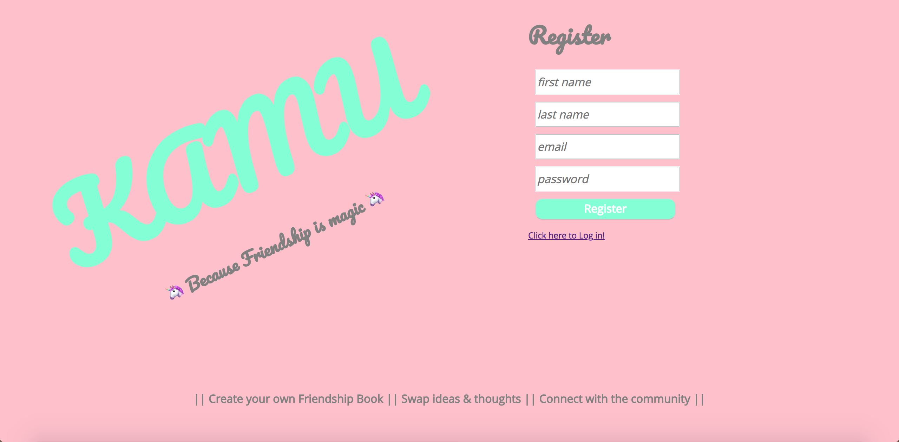

# KAMU - Friendship is magic

KAMU is a Full Stack JavaScript application taking you back to the analog days of "social media". Remember those little books with personal questions you would pass around your friends to find out their interests and secrets? KAMU brings this nostalgic element of your childhood to the digital age. Users can create accounts, assemble their own friendship book, connect with other users and fill out their books. The application also includes a real-time chat enabling users to discuss and connect.

Technologies used:

React/Redux Node/Express socket.io

Functions:
Register/Login/Logout, Profile Picture Upload/Edit, Bio Upload/Edit, Friend Requests, Friendship Book Question and Answers Upload, Group Chat
